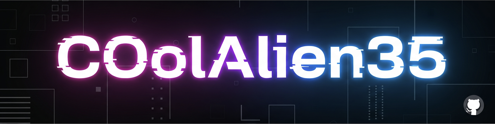

<!-- Banner -->

  

<!-- Typing Animation -->
<h1 align="center">
  

</h1>

---

<!-- ✨ Alien Dashboard Badges -->

  
  
  
  

---

## 👾 Who Am I?

> 👨‍🚀 A tech explorer with a passion for **code + cosmos**  
> 🤓 Competitive Coder • Game Dev • Backend Engineer  
> 💡 Building projects that **solve** + **entertain**  
> 🤝 Always open to **collabs, hacks, and alien summits**

---

## 🛠️ Tech I Command

  
  
  
  
  
  
  
  
  

---

## 🛸 Alien Gallery

  
  
  
  

---

## 📊 GitHub Metrics

  
  

  

  

---

## 🧠 Random Dev Quote

  

---

## 📡 Reach My Mothership

- 📧 `pandeypulkit2005@gmail.com`
- 🔗 [LinkedIn](https://www.linkedin.com/in/pulkit-pandey-b13076319/)
- 🧃 Up for collabs, interstellar chats, or just building cool tech? Ping me!

---

<h3 align="center" style="color:#00F7FF; font-family:Orbitron;">"Ship. Code. Repeat. 🚀"</h3>
<h4 align="center">— Pulkit Pandey a.k.a. <code>COolAlien35</code> 👽</h4>
